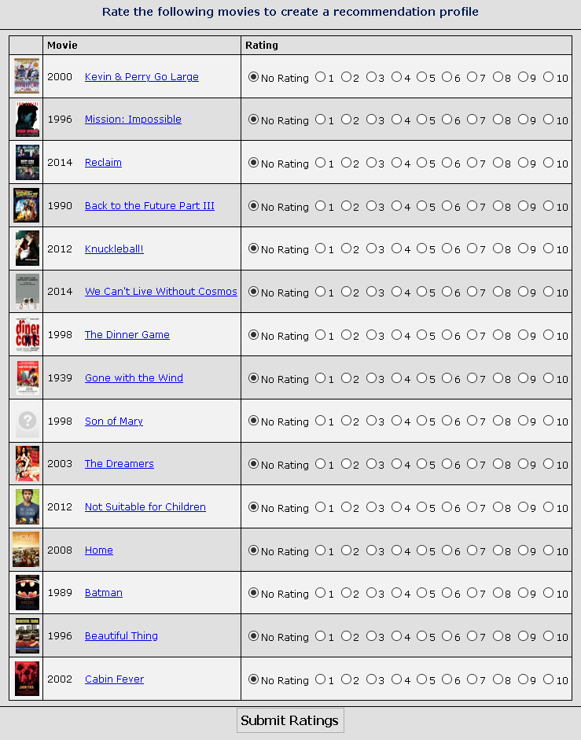
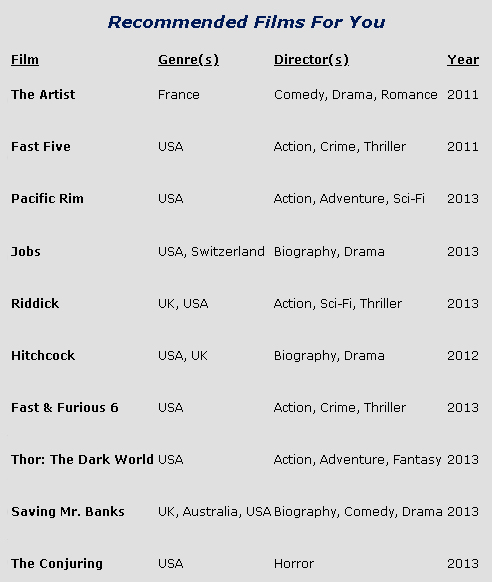

# Movie Recommendation System
## Summary
This project is a movie rating recommendation system, made in Java. The user ratings are read in and parsed into lists and maps. Average ratings are then calculated, and then finally the recommendation list is displayed.

## Process
1. The user is prompted to rate a randomly generated list of movies.

 

2. Once the ratings are submitted, the recommendation results are shown.

